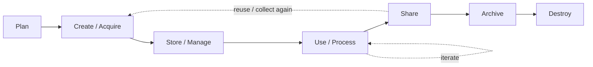
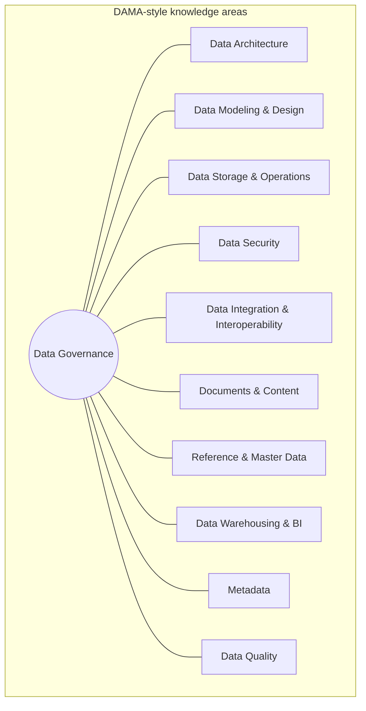
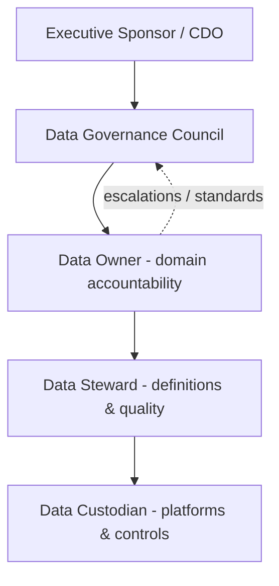
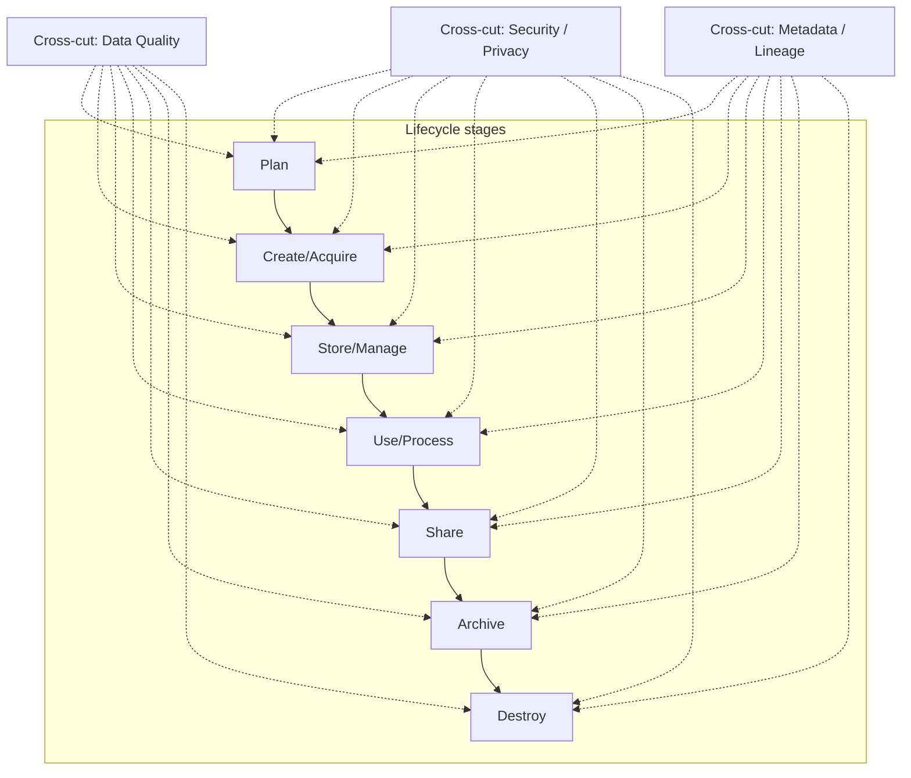
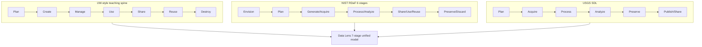
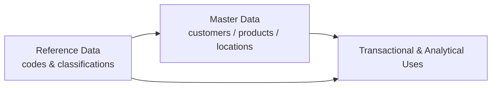

# Data Lens — Mermaid Diagram Sketches

Use these as starting points for the site’s visual components. Map each sketch to modules via `visualHint` (`flow`, `wheel`, `diagram`, `cards`).

---

## 1) Unified data lifecycle flow (7 stages)

**Teaching note:** Dashed edges show common non-linear paths (reuse and iterative analysis).

---

## 2) DAMA wheel (governance at center)

**Teaching note:** Hub-and-spoke emphasizes governance as coordinating center—not that other areas are optional.

---

## 3) Governance org: council / owner / steward / custodian

**Teaching note:** Owners decide; stewards operationalize; custodians implement technical controls; council resolves cross-domain issues.

---

## 4) Plan → Destroy with cross-cuts (quality, security, metadata)

**Teaching note:** Matches USGS-style “cross-cutting elements” and Harvard/UW emphasis that controls and documentation are continuous.

---

## 5) Optional: compare three public models (cards → table visual)

---

## 6) Optional: MDM vs reference data

